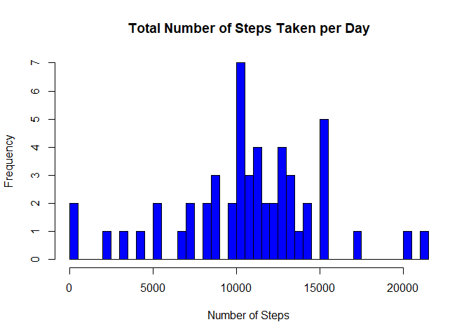
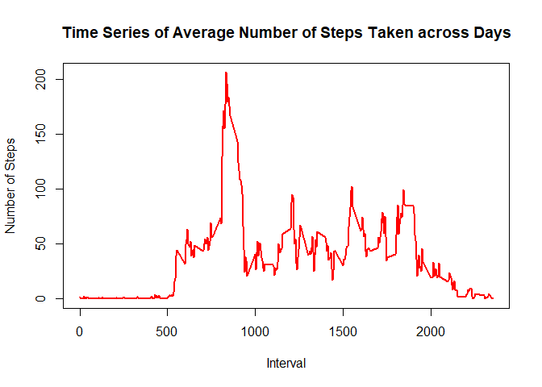
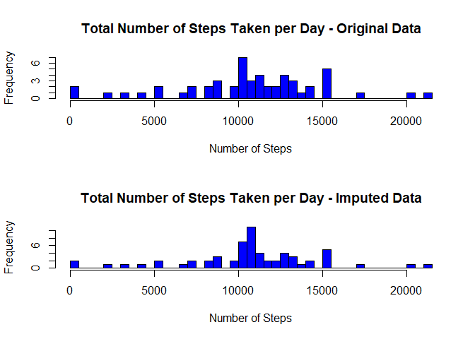
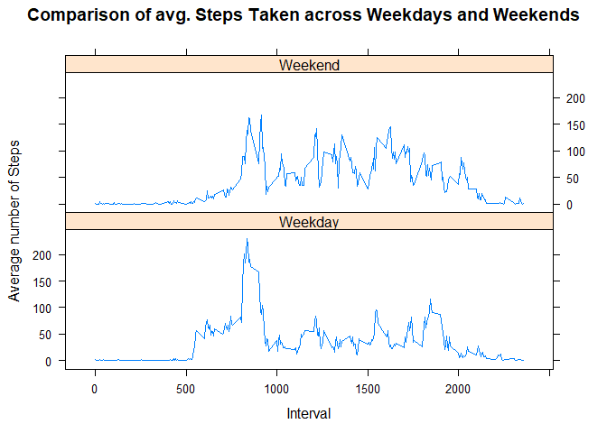

### Loading and preprocessing the data

Show any code that is needed to:  

1. Load the data (i.e. read.csv(), here I use fread())  
2. Process/transform the data (if necessary) into a format suitable for your analysis


```r
# Load required packages
library(data.table)
library(dplyr)
library(lattice)
library(xtable)

# Download the data if necessary
path <- getwd()
url <- "https://d396qusza40orc.cloudfront.net/repdata%2Fdata%2Factivity.zip"

if(!file.exists("activity.csv")) {
        download.file(url,file.path(path, "activity.zip"),  method = "curl")
        unzip("activity.zip")
}

# Load data into R + Transform variable classes
data <- fread("activity.csv")

data$steps <- as.double(data$steps)
data$date <- as.Date(data$date, "%Y-%m-%d")
```


###  What is mean total number of steps taken per day?
For this part of the assignment, you can ignore the missing values in the dataset.

1. Calculate the total number of steps taken per day.  


```r
steps_taken <- aggregate(steps ~ date, data=data, sum, na.rm = TRUE)
```
2. Make a histogram of the total number of steps taken per day. 


```r
par(mfrow = c(1,1))
hist(steps_taken$steps, breaks = 75
     , main = "Total Number of Steps Taken per Day"
     , xlab = "Number of Steps", 
     col =  "blue")
```

<!-- -->

3. Calculate and report the mean and median of the total number of steps taken per day.  


```r
mean1 <- mean(steps_taken$steps)
median1<- median(steps_taken$steps)

print( paste("Mean: ", mean1, "; Median: ", median1, sep = ""))
```

```
## [1] "Mean: 10766.1886792453; Median: 10765"
```


### What is the average daily activity pattern?  
1. Make a time series plot (i.e. type = "l"), of the 5 minute interval (x-axis) and the average number of steps taken averaged across all the days in the dataset.  


```r
intervals <- aggregate(steps ~ interval, data=data, mean, na.rm = TRUE)
plot( x = intervals$interval, y = intervals$steps, type = "l",
      main = "Time Series of Average Number of Steps Taken across Days", 
      xlab = "Interval",
      ylab = "Number of Steps", 
      col = "red", lwd = 2)
```

<!-- -->
  
2. Which 5-minute interval, on average across all the days in the dataset contains the maximum number of steps?


```r
intervals <- intervals[order(-intervals$steps),]
max_interval <- intervals[[1, "interval"]]
print(paste(max_interval, " is the interval which contains the maximum number of steps across all days.", sep = ""))
```

```
## [1] "835 is the interval which contains the maximum number of steps across all days."
```


### Imputing missing values
Note, that there are a number of days/intervals, where there are missing values (coded as NA). The presence of missing days may introduce bias into some calculations or summaries of the data.  

1. Calculate and report the total number of missing values in the dataset (i.e. the total number of rows with NAs) 


```r
num_NAs <- sum(is.na(data$steps))
print(paste("The number of missing values in the dataset is: ", num_NAs, sep = ""))
```

```
## [1] "The number of missing values in the dataset is: 2304"
```

2. Devise a strategy for filling in all of the missing values in the dataset. The strategy doe not need to be sophisticated. For example, you could use the mean/median for that day, or the mean/median for that 5-minute interval.  

I do not think it makes sense to use the mean or median for that day, because there are whole days for which the data is missing, i.e. days, for which no mean can be determined (e.g. 2012-10-01). Therefore I am going to use the mean for the respective interval, as there are mean values for each recorded interval. That way I can reuse the `intervals` data frame and model an average day, which should only insignificantly infer with the mean or median summaries. 

3. Create a new dataset that is equal to the original dataset, but with the missing data filled in.


```r
data_NArm <- data 
length_df <- nrow(data_NArm)

for (i in 1:length_df) {
        if (is.na(data_NArm[i, "steps"]) == TRUE){
                data_NArm[i, "steps"] <-
                        round(filter(intervals, interval ==  data_NArm[[i,"interval"]])[["steps"]])
        }
}
```

4. Make a histogram of the total number of steps taken each day and calculate and report the mean and median total number of steps taken per day. Do these values differ from the estimates from the first part of the assignment? What is the impact of imputing missing data on the estimates of the total daily number of steps?  


```r
steps_taken2 <- aggregate(steps ~ date, data=data_NArm, sum, na.rm = TRUE)

par(mfcol = c(2,1))
hist(steps_taken$steps, breaks = 75
     , main = "Total Number of Steps Taken per Day - Original Data"
     , xlab = "Number of Steps"
     , col = "blue")
hist(steps_taken2$steps, breaks = 75
     , main = "Total Number of Steps Taken per Day - Imputed Data"
     , xlab = "Number of Steps"
     , col = "blue")
```

<!-- -->


```r
mean2 <- mean(steps_taken2$steps)
median2 <- median(steps_taken2$steps)

comparison <- as.data.frame(cbind(c(mean1, median1), c(mean2, median2)),
                            row.names <- c("Mean", "Median"))
names(comparison) <- c("Original Data", "Imputed Data")

xt <- xtable(comparison)
print(xt, type = "html")
```

<!-- html table generated in R 3.6.3 by xtable 1.8-4 package -->
<!-- Thu Apr 30 13:03:33 2020 -->
<table border=1>
<tr> <th>  </th> <th> Original Data </th> <th> Imputed Data </th>  </tr>
  <tr> <td align="right"> Mean </td> <td align="right"> 10766.19 </td> <td align="right"> 10765.64 </td> </tr>
  <tr> <td align="right"> Median </td> <td align="right"> 10765.00 </td> <td align="right"> 10762.00 </td> </tr>
   </table>
  
As expected, there are no significant differences between the mean and median summaries of the Original and Imputed Data. That should be obvious, as no additional information or bias is added to the dataset, only another average day.

## Are there differences in activity patterns between weekdays and weekends?

For this part the weekdays() function may be of some help here. Use the dataset with the filled-in missing values for this part.  

1. Create a new factor variable in the dataset with two levels - "Weekday" and "Weekend" indicating whether a given date is a weekday or weekend day.  


```r
for(i in 1:length_df){
        if(weekdays(data_NArm[[i,"date"]]) == "Samstag" |
           weekdays(data_NArm[[i,"date"]]) == "Sonntag") {
                data_NArm[i, "day_class"] <- "Weekend"
        }
        else {
                data_NArm[i, "day_class"] <- "Weekday" 
        }
}

data_NArm$day_class <- as.factor(data_NArm$day_class)
```

2. Make a panel plot containing a time series plot (i.e. type = "l") of the 5-minute interval (x-axis) and the average number of steps taken, averaged across all weekday days or weekend days (y-axis). See the README file in the GitHub repository to see an example of what this plot should look like using simulated data.


```r
steps_taken3 <- aggregate(steps ~ interval + day_class, data=data_NArm, mean, na.rm = TRUE)

xyplot(steps ~ interval | day_class, data = steps_taken3,
       type = "l",
       xlab = "Interval",
       ylab = "Average number of Steps",
       main = "Comparison of avg. Steps Taken across Weekdays and Weekends",
       layout = c(1,2))
```

<!-- -->


